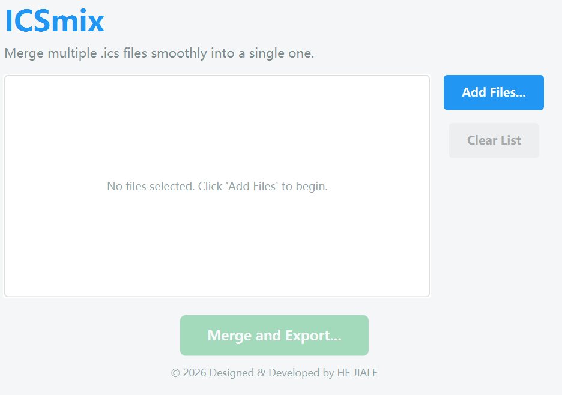

# ICSmix - Advanced iCalendar Merger Tool 

This is a lightweight and modern desktop application developed with Java and JavaFX, designed to solve the common pain point of managing multiple `.ics` calendar files. It allows users to easily merge several calendar files (such as university course schedules, meetings, etc.) into a single `.ics` file for a hassle-free, one-time import into any calendar software.

##  Core Features
* **Modern & Intuitive UI:** Features a clean, flat-design interface. Users can easily browse and select multiple `.ics` files via a native system file chooser dialog.
* **High Compatibility:** Powered by the robust `iCal4j` library with "relaxed parsing" enabled. It perfectly handles and merges slightly malformed calendar files often exported from university portals or third-party apps without crashing.
* **Customizable Export:** One-click merging with a pop-up dialog to choose your exact save location and filename, ensuring your original files are safely preserved.

##  How to Run
1. Ensure you have Java 21 or a higher version installed on your local machine.
2. Clone this repository to your local environment: `git clone https://github.com/YourGitHubUsername/ICSmix.git` (Remember to replace 'YourGitHubUsername' with your actual username)
3. Open the project using IntelliJ IDEA and wait for Maven to automatically resolve and download the dependencies.
4. Run `src/main/java/org/example/Launcher.java` to start the graphical interface.

---
*Designed & Developed by JerryHe*